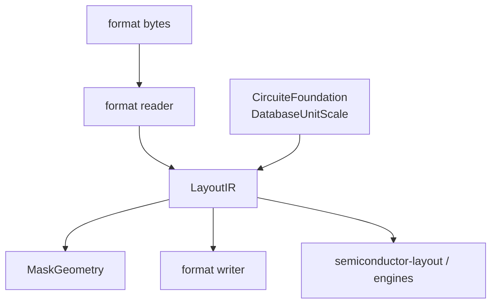

# swift-mask-data design

## Purpose

The package is the standard-mask-data boundary for independently usable design
tools. It converts files into a stable intermediate representation and provides
geometry operations without knowing how a project is scheduled or approved.

## Layer responsibilities

| Layer | Owns | Does not own |
|---|---|---|
| `LayoutIR` | Format-neutral geometry, hierarchy references, properties, and units | Physical process-rule interpretation |
| Format codecs | Parsing and serialization of one standard format | Generic project state |
| `TechIR` | Format-neutral technology records | Foundry qualification decisions |
| `MaskGeometry` | Polygon boolean/sizing/connectivity and geometry checks | Electrical netlist semantics |

## CircuiteFoundation contract

`CircuiteFoundation` is a direct dependency of `LayoutIR`:

- `DatabaseUnitScale` validates positive finite database-unit scales.
- `IRLibrary.databaseUnitScale` owns `DatabaseUnitScale` directly. LayoutIR
  does not define a second unit type or accept an unvalidated raw scale.
- Artifact, provenance, diagnostic, and engine protocols remain available to
  consuming packages; this library does not wrap codec calls in a generic
  engine envelope.

## Exactness policy

`Region.intersection`, `union`, `symmetricDifference`, and `subtracting` use
only the exact rectilinear kernel. They throw
`RegionBooleanError.unsupportedNonManhattanGeometry` for unsupported geometry.
There is no public approximate fallback path, so every consumer observes the
same failure contract.

## Extension point for implementation agents

Agents adding a new format should add a codec target/file set, map it to
`LayoutIR`, preserve typed parse/write errors, and add round-trip fixtures. They
should not add project/run state or duplicate `DatabaseUnitScale` validation.
