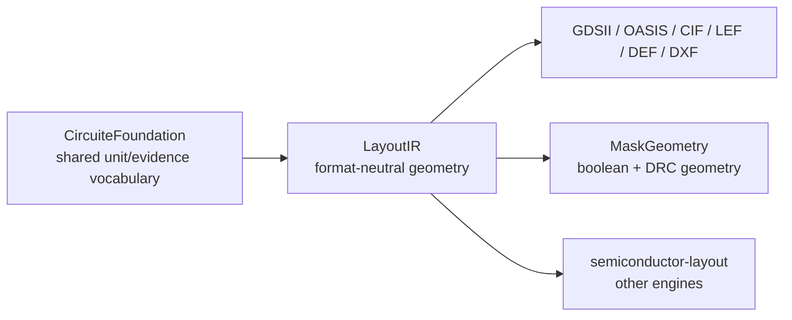

# swift-mask-data

`swift-mask-data` is an independent Swift library for reading, writing, and
manipulating semiconductor mask data. It provides format-specific codecs and a
format-neutral layout/technology IR. It does not own a project lifecycle,
design-flow scheduler, or foundry signoff policy.

## Xcircuite integration

[`Xcircuite`](https://github.com/1amageek/Xcircuite) is the umbrella runtime
that consumes this package's standard mask-data artifacts at layout, DRC, LVS,
and PEX stage boundaries. `swift-mask-data` remains independently usable and
owns format codecs, mask geometry, and the format-neutral layout/technology IR.

## Boundary with CircuiteFoundation



`LayoutIR.IRLibrary` stores
`CircuiteFoundation.DatabaseUnitScale` directly. Every codec receives or
decodes a validated scale before coordinate conversion, so an unvalidated raw
floating-point scale cannot enter the format-neutral layout model.

## Modules

| Module | Responsibility |
|---|---|
| `LayoutIR` | Shared cells, elements, coordinates, transforms, properties, and units |
| `GDSII` | GDSII Stream reader/writer |
| `OASIS` | OASIS 1.0 reader/writer |
| `CIF` | Caltech Intermediate Form reader/writer |
| `LEF` | Library Exchange Format reader/writer |
| `DEF` | Design Exchange Format reader/writer |
| `DXF` | Drawing Exchange Format reader/writer |
| `TechIR` | Codable technology IR for layers, vias, and rules |
| `FormatDetector` | Input format detection |
| `MaskGeometry` | Boolean, sizing, connectivity, and geometry-level DRC operations |

## Guarantees and boundaries

- All public IR values are `Codable`, `Hashable`, and `Sendable`.
- Format codecs preserve representable standard data and fail with typed errors
  for malformed input.
- `Region.intersection`, `union`, `symmetricDifference`, and `subtracting`
  are throwing exact operations. They reject unsupported non-Manhattan
  geometry instead of silently selecting an approximate kernel.
- Geometry algorithms remain owned by `MaskGeometry`; Foundation only supplies
  cross-package vocabulary and validated unit conversion.

## Build and test

```bash
swift build
swift test
```

The package requires Swift 6.3 or later and macOS 26 or later. See `DESIGN.md`,
`REQUIREMENTS.md`, and `GOAL_STATUS.md` for implementation-agent guidance.
